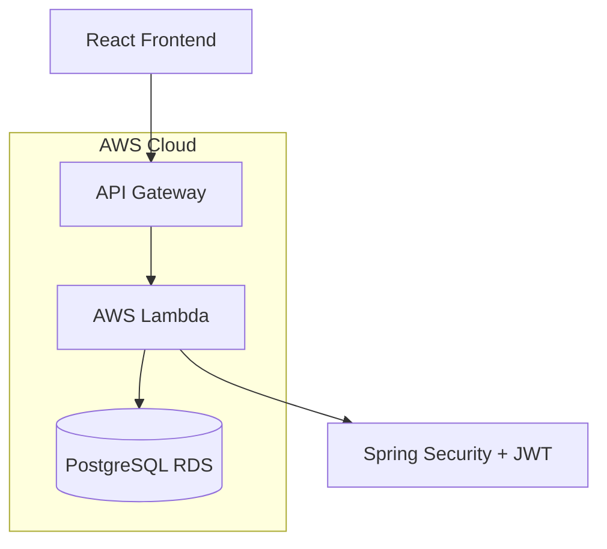

# 📋 CloudList

> **Um sistema completo de gerenciamento de tarefas (To-Do List) construído com arquitetura serverless na AWS**

[](https://openjdk.java.net/projects/jdk/21/)
[](https://spring.io/projects/spring-boot)
[](https://reactjs.org/)
[](https://www.typescriptlang.org/)
[](https://aws.amazon.com/lambda/)
[](https://www.postgresql.org/)

## 🚀 Visão Geral

O **CloudList** é uma aplicação moderna de gerenciamento de tarefas que combina a flexibilidade do Spring Boot com a escalabilidade da arquitetura serverless da AWS. O projeto está dividido em duas partes principais:

- **Backend**: API REST construída com Spring Boot e deployada como AWS Lambda
- **Frontend**: Interface web moderna em React + TypeScript

## 🏗️ Arquitetura



### 🔧 Stack Tecnológica

#### Backend
- **Java 21** - Linguagem principal
- **Spring Boot 3.5.5** - Framework web
- **Spring Security** - Autenticação e autorização
- **Spring Data JPA** - Persistência de dados
- **JWT** - Tokens de autenticação
- **PostgreSQL** - Banco de dados relacional
- **AWS Lambda** - Execução serverless
- **AWS SAM** - Infrastructure as Code
- **Maven** - Gerenciador de dependências

#### Frontend
- **React 18** - Biblioteca de interface
- **TypeScript** - Tipagem estática
- **Vite** - Build tool e dev server
- **Tailwind CSS** - Framework de estilos
- **ESLint** - Linter de código

#### Infraestrutura AWS
- **AWS Lambda** - Compute serverless
- **API Gateway** - Gateway de APIs
- **RDS PostgreSQL** - Banco de dados gerenciado
- **VPC** - Rede privada virtual
- **CloudFormation** - Provisionamento de recursos

## 🎯 Funcionalidades

### ✅ Principais Features

- 🔐 **Autenticação JWT** - Sistema seguro de login/registro
- 📋 **CRUD de Tarefas** - Criar, ler, atualizar e deletar tarefas
- 👤 **Gerenciamento de Usuários** - Perfis de usuário individuais
- 🌐 **API RESTful** - Endpoints bem estruturados
- 📱 **Interface Responsiva** - Design adaptável para todos os dispositivos
- ☁️ **Arquitetura Serverless** - Alta disponibilidade e escalabilidade
- 🔒 **Segurança Robusta** - Proteção contra ataques comuns

### 📋 Endpoints da API

| Método | Endpoint | Descrição | Autenticação |
|--------|----------|-----------|--------------|
| `POST` | `/api/v1/auth/login` | Realizar login | ❌ |
| `POST` | `/api/v1/auth/register` | Criar conta | ❌ |
| `GET` | `/api/v1/todos` | Listar todas as tarefas | ✅ |
| `POST` | `/api/v1/todos` | Criar nova tarefa | ✅ |
| `PUT` | `/api/v1/todos/{id}` | Atualizar tarefa | ✅ |
| `DELETE` | `/api/v1/todos/{id}` | Deletar tarefa | ✅ |
| `GET` | `/api/v1/users` | Listar usuários | ✅ |
| `PUT` | `/api/v1/users/{id}` | Atualizar usuário | ✅ |
| `DELETE` | `/api/v1/users/{id}` | Deletar usuário | ✅ |

## 🚀 Como Executar

### 📋 Pré-requisitos

- Java 21+
- Node.js 18+
- AWS CLI configurado
- AWS SAM CLI
- PostgreSQL (local ou RDS)
- Maven 3.8+

### 🔧 Configuração do Backend

1. **Clone os repositórios:**
```bash
# Backend
git clone https://github.com/Zambrinn/CloudList.git
cd CloudList

# Frontend (em outro terminal)
git clone https://github.com/Zambrinn/CloudList-frontend.git
cd CloudList-frontend
```

2. **Configure o banco de dados:**
```bash
# Edite src/main/resources/application.properties
spring.datasource.url=jdbc:postgresql://localhost:5432/todolist
spring.datasource.username=seu_usuario
spring.datasource.password=sua_senha
```

3. **Execute localmente:**
```bash
# Compilar o projeto
./mvnw clean compile

# Executar os testes
./mvnw test

# Executar localmente (desenvolvimento)
./mvnw spring-boot:run
```

4. **Deploy na AWS:**
```bash
# Build da aplicação
./mvnw clean package

# Deploy com SAM
sam build
sam deploy --guided
```

### ⚛️ Configuração do Frontend

1. **Instale as dependências:**
```bash
npm install
```

2. **Configure as variáveis de ambiente:**
```bash
# Crie um arquivo .env.local
VITE_API_URL=https://sua-api-gateway-url.execute-api.us-east-1.amazonaws.com/Prod
```

3. **Execute o desenvolvimento:**
```bash
# Servidor de desenvolvimento
npm run dev

# Build para produção
npm run build

# Preview da build
npm run preview
```

## 📁 Estrutura do Projeto

### Backend Structure
```
CloudList/
├── src/
│   ├── main/
│   │   ├── java/br/com/todolist/aws_lambda_todo/
│   │   │   ├── auth/              # Configurações de segurança
│   │   │   ├── controller/        # Controllers REST
│   │   │   ├── dto/              # Data Transfer Objects
│   │   │   ├── exception/        # Tratamento de exceções
│   │   │   ├── model/            # Entidades JPA
│   │   │   ├── repository/       # Repositórios JPA
│   │   │   ├── service/          # Lógica de negócio
│   │   │   ├── AwsLambdaTodoApplication.java
│   │   │   └── StreamLambdaHandler.java
│   │   └── resources/
│   │       └── application.properties
│   └── test/                     # Testes unitários
├── todoApiCollection/            # Coleção de testes da API
├── template.yaml                 # Template SAM
├── pom.xml                      # Dependências Maven
└── samconfig.toml              # Configuração SAM
```

### Frontend Structure
```
CloudList-frontend/
├── src/
│   ├── components/              # Componentes reutilizáveis
│   ├── pages/                   # Páginas da aplicação
│   ├── services/               # Serviços de API
│   ├── types/                  # Tipos TypeScript
│   ├── hooks/                  # Custom hooks
│   └── utils/                  # Utilitários
├── public/                     # Arquivos estáticos
├── index.html
├── vite.config.ts             # Configuração Vite
├── tailwind.config.js         # Configuração Tailwind
└── package.json
```

## 🧪 Testes

### Backend
```bash
# Executar todos os testes
./mvnw test

# Executar testes com relatório de cobertura
./mvnw test jacoco:report
```

### API Testing
O projeto inclui uma coleção completa de testes da API no diretório `todoApiCollection/` que pode ser usada com ferramentas como Bruno ou Postman.

## 🔒 Segurança

- **JWT Authentication**: Tokens seguros para autenticação
- **Spring Security**: Configuração robusta de segurança
- **CORS Configuration**: Controle de origem cruzada
- **Input Validation**: Validação de dados de entrada
- **SQL Injection Protection**: Proteção via JPA/Hibernate

## 🌐 Deploy

### AWS Infrastructure

O projeto utiliza AWS SAM para definir a infraestrutura como código:

- **Lambda Function**: Executa a aplicação Spring Boot
- **API Gateway**: Expõe os endpoints HTTP
- **RDS PostgreSQL**: Banco de dados gerenciado
- **VPC**: Rede privada para segurança
- **Security Groups**: Controle de acesso de rede

### Variáveis de Ambiente

```yaml
# template.yaml
Environment:
  Variables:
    DB_URL: jdbc:postgresql://endpoint:5432/database
    DB_USERNAME: username
    DB_PASSWORD: password
```

## 🤝 Contribuição

1. Faça um fork do projeto
2. Crie uma branch para sua feature (`git checkout -b feature/AmazingFeature`)
3. Commit suas mudanças (`git commit -m 'Add some AmazingFeature'`)
4. Push para a branch (`git push origin feature/AmazingFeature`)
5. Abra um Pull Request

## 📄 Licença

Este projeto está sob a licença MIT. Veja o arquivo [LICENSE](LICENSE) para mais detalhes.

## 👤 Autor

**Zambrin**
- GitHub: [@Zambrinn](https://github.com/Zambrinn)
- LinkedIn: [Thiago Zambrin](https://linkedin.com/in/thiagozambrin)

## 🙏 Agradecimentos

- Spring Boot Team pela excelente documentação
- AWS pela infraestrutura serverless robusta
- Comunidade React pela evolução constante do ecossistema

---

⭐ **Se este projeto te ajudou, deixe uma estrela!** ⭐
